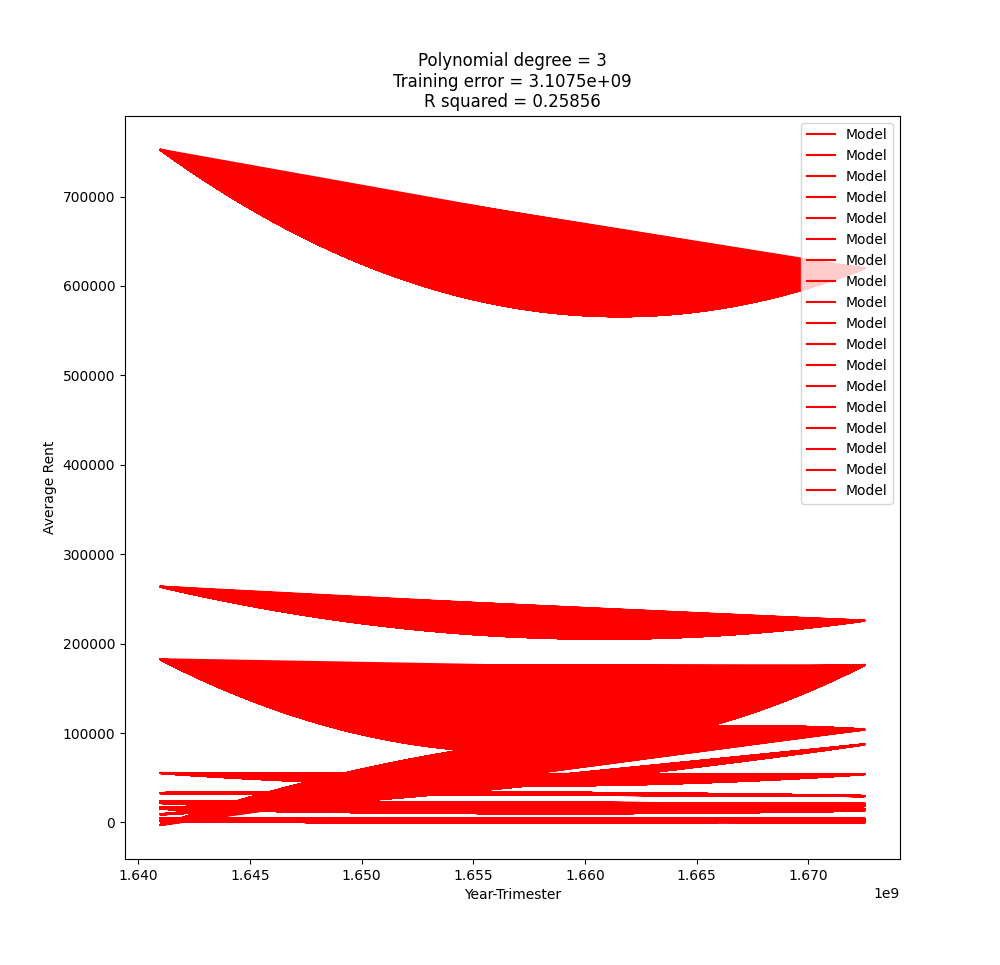
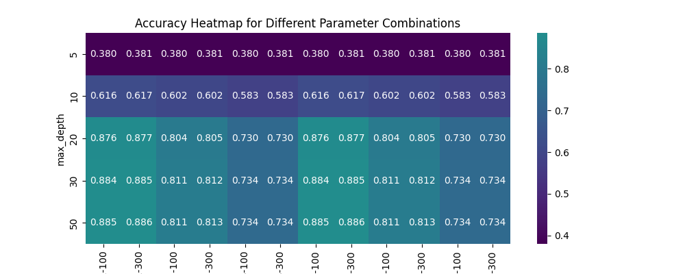

# Ecoforecast Challenge 2023
EcoForecast: Revolutionizing Green Energy Surplus Prediction in Europe

### The problem

This is a Nuew challenge [link](https://nuwe.io/dev/competitions/schneider-electric-european-2023/ecoforecast-revolutionizing-green-energy-surplus-prediction-in-europe) the goal of which is to predict which country on a list will be the one with the most surplus of green energy.

Since we don't receive the data directly neither for doing the predictions, we retrieved it using ENTSOE API, and split it into the [test_data.csv](./data/test_data.csv) and [train_data.csv](./data/train_data.csv).

### Run the model yourself

- Depending on your PC you might need to do it in a virtual environment (I personally had to):
```
python -m venv path/to/venv
source path/to/venv/bin/activate
```
- Then install the requirements:
```
pip install -r requirements.txt
```
**Note**: that all the exections must be done from the main folder in order for them to work properly.
- After you can:
A. Run one by one the files in the [src](./src/) folder:
```
python3 src/get_data.py
python3 src/get_train_test.py
python3 src/model_train_predict.py
```
B. Use the bash script:
```
chmod +x scripts/run_pipeline.sh
./scripts/run_pipeline.sh
```
**Note**: on the _*run_pipline.sh*_ script there's a commented flags on the 4th line that can be uncommented for the execution to reaload all the data again from the server.

> Note that some plot will be appearing during the execution, you can look at them to see how the model performs.
> The results of the predictions will be stored on the [predictions](./predictions/) folder and the models on the [models](./models/) folder.

You can as well run it online on a prepared [Google Colab](https://colab.research.google.com/drive/1ROKeqyYTzW2muFEA1-dAsgBHwFxoVSh8?usp=sharing).

### Results

After seeing the evaluation values of the polynomial model, in any degree is worst that in the random forest predictor, we ended up by deciding to use this last one for predicting the final values. Indeed what we are predicting is the load and generation of energy for each country on a specific hour. Then a deterministic algorithm decides which country is the one with the most surplus.





The final values regarding the metrics of our predictions compared to ground truth are the following:
Accuracy: 0.9994295493439818
Precision: 0.9977298524404086
Recall: 0.9994314951677089
F1 Score: 0.9985799488781595
